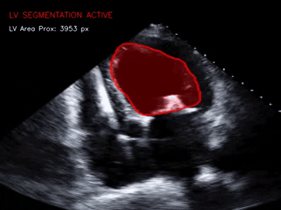

# Real-Time LV Segmentation for Echocardiography

Live left-ventricle (LV) segmentation overlay for echo video, using a Keras U-Net for prediction and OpenCV for pre/post-processing and display.



## What it does

Reads frames from a video source, runs each through a U-Net to get a per-pixel LV probability map, then applies temporal smoothing, thresholding, and morphological cleanup before overlaying the resulting mask and contour on the original frame in a live HUD window.

## Pipeline

1. **Preprocess** — convert frame to grayscale, resize to model input size, normalize to `[0, 1]`.
2. **Predict** — run the U-Net to get a probability map at model resolution.
3. **Temporal smoothing** — exponential moving average of the probability map across frames (`TEMPORAL_ALPHA`) to reduce flicker.
4. **Upsample** — resize the probability map (not the binary mask) back to the original frame size with cubic interpolation, then Gaussian blur for a smoother boundary.
5. **Threshold** — binarize at `THRESHOLD` to get the mask.
6. **Morphological cleanup** — opening (remove speckle) + closing (fill small holes) using an elliptical kernel (`MORPH_KERNEL_SIZE`).
7. **Largest component filter** — keep only the biggest connected blob, dropping stray false positives.
8. **Overlay** — blend a red mask (`ALPHA` opacity) onto the frame, draw a smoothed contour (`approxPolyDP`), and add HUD text (status + LV area in pixels).

## Requirements

```
opencv-python
numpy
tensorflow
```

## Usage

1. Set `MODEL_PATH` to your trained `.keras` U-Net checkpoint.
2. Set `VIDEO_SOURCE` to a video file path, or a camera index (e.g. `0`) for a live feed.
3. Run:

```bash
python live_lv_segmentation.py
```

4. Press `q` to quit the display window.

## Key configuration

| Variable | Purpose |
|---|---|
| `MODEL_IMG_SIZE` | Input resolution expected by the U-Net |
| `THRESHOLD` | Probability cutoff for binarizing the mask |
| `MORPH_KERNEL_SIZE` | Size of the morphological opening/closing kernel |
| `TEMPORAL_SMOOTHING` / `TEMPORAL_ALPHA` | Enable/tune frame-to-frame probability blending |
| `KEEP_LARGEST_ONLY` | Restrict output to the single largest connected blob |
| `ALPHA` | Overlay opacity for the mask |

## Notes / known behavior

- Frame skipping: the loop currently `continue`s on every other frame (`frame_idx % 2`) *before* incrementing any further processing, effectively processing roughly half the frames — check this matches your intended frame rate.
- Output display is fixed to `640x480` regardless of source resolution.
- LV area is reported in raw pixel count, not physical units (no pixel-spacing/calibration applied) — a real deployment would need calibration to report area in cm².
- This is a visualization/demo script (`cv2.imshow` loop), not a batch-inference or evaluation pipeline.
